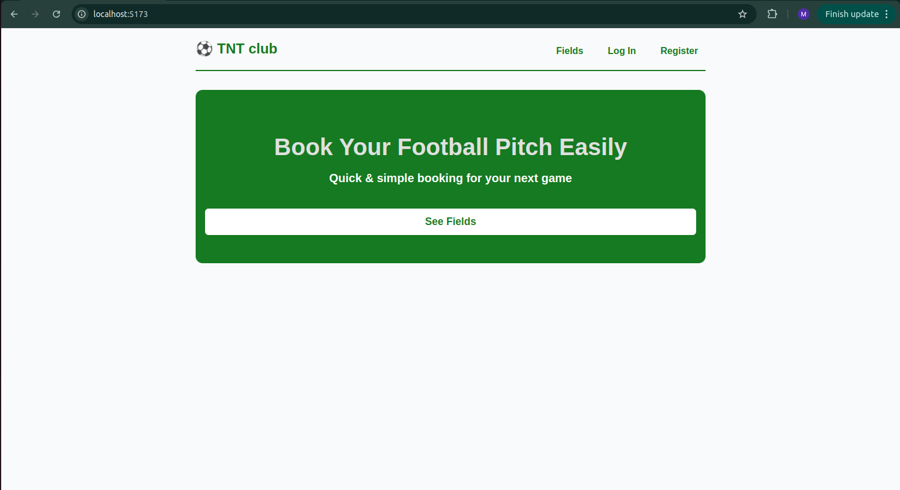
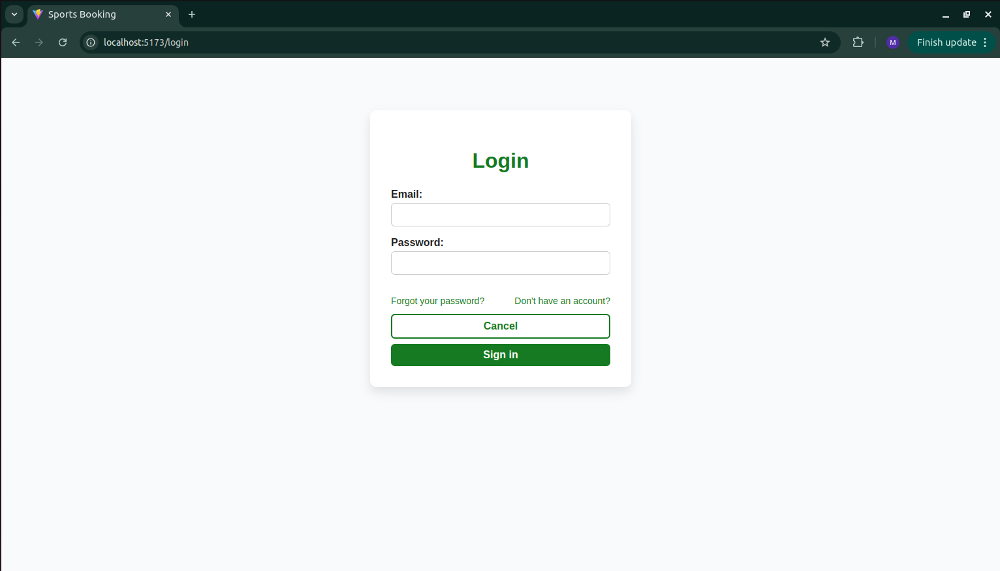
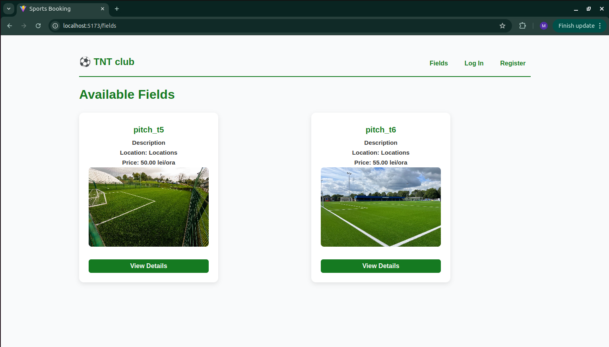
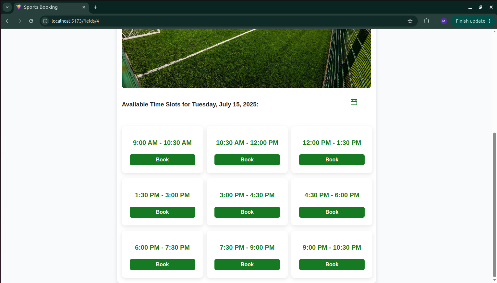
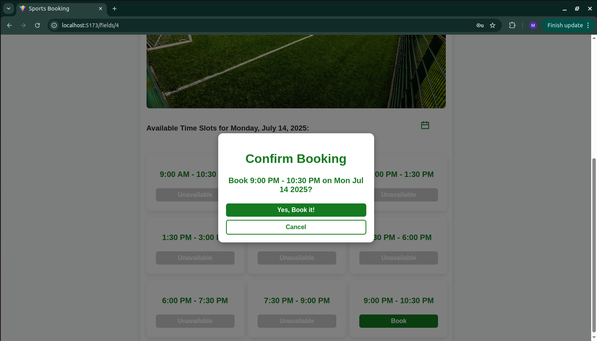
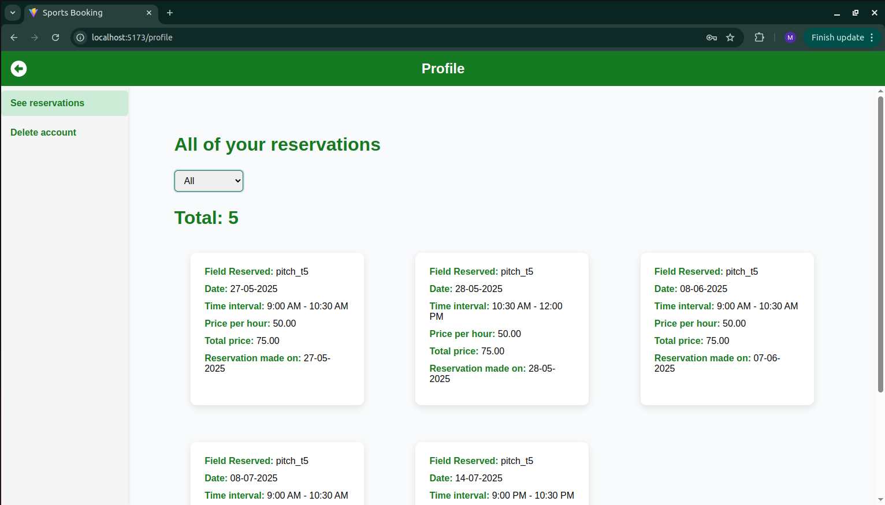

# Complex Sportiv - Football Pitch Booking Platform

A full-stack web application for booking football pitches online, built as a thesis project at *Vasile Alecsandri University of Bacău*. The platform allows users to browse available time slots, reserve fields, and manage bookings, while providing admins with tools to manage pitches and schedules.

---

## Table of Contents

- [Features](#features)
- [Tech Stack](#tech-stack)
- [Screenshots](#screenshots)

## Features

### For Users
- Create an account and log in
- View available football pitches
- See open time slots by date
- Book pitches for a selected time
- View and manage personal reservations

### For Admins
- Add/delete football pitches
- See bookings for a day
- Make bookings for customers who called in

## Tech Stack

### Frontend
- **React.js** - UI library
- **React Router** - Routing and navigation
- **CSS Modules** - Styling 
- **React Context** - State management

### Backend
- **Node.js** - Server environment
- **Express.js** - Web framework
- **PostgreSQL** - Database 
- **JWT** - Authentication
- **Jest/Supertest** - Testing

## Screenshots

**HomePage**

**Login form**

**Register form**

**Fields page**

**Slot booking and selecting the date**

**Confirmation of booking**

**Profile page with history of reservations**

